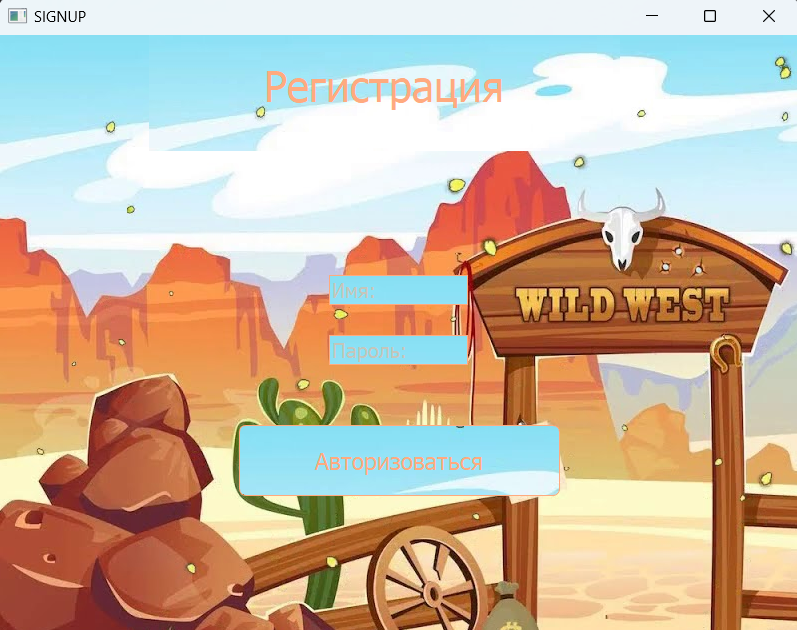

# Проект PyGame: Wild West

### Выполнили: Соколенко Дарья и Краснопольская Полина

---

Wild West - это игра файтинг в стиле дикого запада, в которой происходит бой между двумя персонажами. На одной стороне стоит первый герой, 
а на другой — второй. Цель каждого игрока - убить противника с минимальными потерями здоровья для себя. 
Игра предполагает участие двух человек.

---

## Правила:
При запуске приложения игрок попадает в главное меню. Чтобы начать играть, человеку нужно авторизоваться, нажав для этого соответсвующую кнопку.
После авторизации выбрать уровень. На каждом уровне битва состоит из трех раундов. Побеждает тот, кто одержал победу в наибольшом количестве раундов.
После окончания игры можно начать заново, выбрав любой уровень.

* **Доступные уровни**:

  - Легкий

  - Средний

  - Сложный

На каждом уровне свой фон и звук игры. С увеличением сложности уровня уменьшается урон, наносимый при ударе противнику.
Становится сложнее убить, длительность раунда увеличивается.
* **Управление**:

|              | Игрок слева | Игрок справа  |
|:-------------|:-----------:|:-------------:|
| **Движение** |    A W D    |     < ^ >     |
| **Удар**     |   R или T   |    O или P    |
           

--- 

## Структура

> папка `assets` - данные необходимые для работы программы
>> база данных `login.db` - хранение информации об авторизации пользователей
>
> папка `classes` 
> 
> папка ui

| Название класса | Содержание |
|:---------------:|:----------:|
|                 |            |
|                 |            |

#### Все окна, кроме игровых, написаны с использованием библиотеки PyQt5, игровые - PyGame.

---

## Запуск

- основной исполняемый файл программы `main.py`
- необходимые зависимости созданы в файле `requirements.txt`, команда для установки зависимостей - `pip install -r requirements.txt`

## Перспективы развития

- выбор персонажа, за которого будешь играть
- таблица лидеров по количеству побед
- 

### Програмные окна

- *Главное окно*

- *Окно авторизации*

- *Окно выбора уровня*

- *Окно легкого уровня*

- *Окно среднего уровня*

- *Окно сложного уровня*

